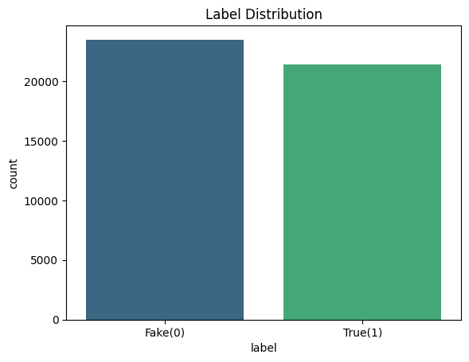
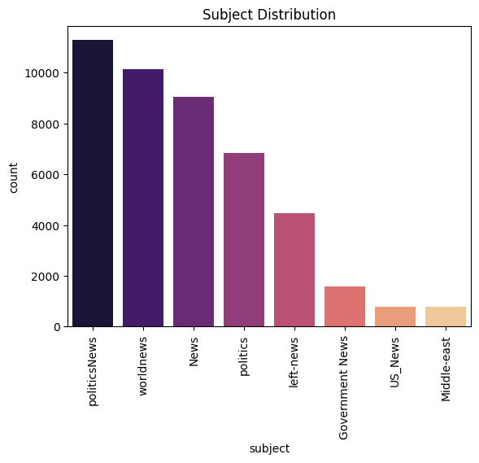
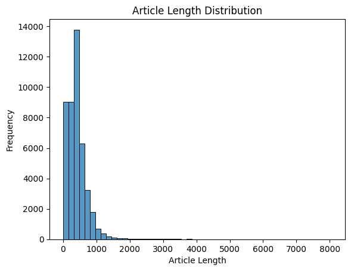
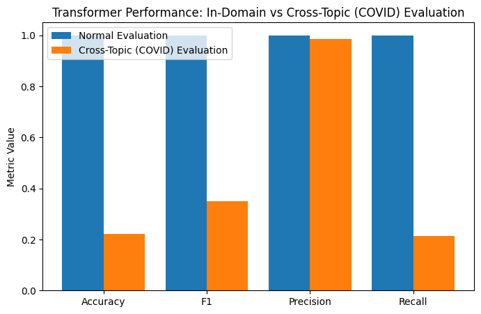

# Fake News Detection and Cross-Topic Generalisation using Machine Learning and DistilBERT

## Overview

This project investigates the effectiveness of machine learning and transformer-based models for fake news detection. While many fake news classifiers achieve excellent performance on standard benchmark datasets, this project examines whether these models can generalise to unseen topics.

Classical machine learning models and a DistilBERT transformer model were trained using publicly available fake and real news datasets and evaluated on both in-domain and cross-topic (COVID-19) datasets to assess their robustness.

---
## Project Motivation

Many fake news detection models report extremely high accuracy on benchmark datasets. However, these datasets often contain articles from similar topics as the training data. This project investigates whether such models can generalise to unseen domains by evaluating them on COVID-19 news articles.

---

## Objectives

- Develop machine learning models for fake news classification.
- Compare the performance of classical machine learning algorithms and transformer-based models.
- Evaluate model generalisation on unseen topics.
- Investigate the causes of performance degradation across different domains.
- Communicate findings through data visualisation and technical reporting.

---

## Dataset

The project uses publicly available news datasets containing genuine and fake news articles.

### Datasets

- `Fake.csv`
- `True.csv`
- `NewsFakeCOVID-19.csv`
- `NewsRealCOVID-19.csv`

Each article contains metadata including the title, subject, publication date and article content.

---

## Technologies Used

### Programming

- Python
- Jupyter Notebook

### Libraries

- Pandas
- NumPy
- Scikit-learn
- Hugging Face Transformers
- DistilBERT
- Matplotlib
- Seaborn
- spaCy

### Machine Learning

- Logistic Regression
- Random Forest
- Support Vector Machine (SVM)
- DistilBERT Transformer

### NLP Techniques

- Text Preprocessing
- Tokenisation
- Stopword Removal
- Lemmatization
- TF-IDF Vectorisation

---

## Methodology

1. Load and combine fake and genuine news datasets.
2. Perform data cleaning and preprocessing.
3. Apply natural language preprocessing including tokenisation, stopword removal and lemmatization.
4. Generate TF-IDF features for classical machine learning models.
5. Fine-tune a DistilBERT transformer model.
6. Evaluate model performance using both in-domain and cross-topic datasets.
7. Compare model robustness using Accuracy, Precision, Recall and F1-score.

---

## Results

| Model | In-Domain Performance | Cross-Topic Performance |
|--------|----------------------|-------------------------|
| Logistic Regression | High Accuracy | Performance decreased |
| Random Forest | High Accuracy | Performance decreased |
| Support Vector Machine | High Accuracy | Performance decreased |
| DistilBERT | **99.94% Accuracy** | Significant performance drop (**22% Accuracy**) on COVID-19 articles |

---

## Key Findings

- All models achieved excellent performance on the original test dataset.
- DistilBERT achieved approximately **99.94%** in-domain accuracy.
- Model performance declined significantly when evaluated on unseen COVID-19 articles.
- The results suggest that high benchmark accuracy does not necessarily imply good real-world generalisation.
- Cross-topic evaluation highlighted the importance of testing machine learning models on unseen domains before deployment.
- High benchmark accuracy alone is not sufficient to assess model robustness.

---

## Repository Structure

- `data/` – Raw datasets
- `notebooks/` – Data preprocessing, model training and evaluation
- `reports/` – Project report
- `visualisations/` – Exploratory analysis and model evaluation figures

---

## Sample Visualisations

### Label Distribution

### Subject Distribution

### Article Length Distribution

### Transformer Performance

---

## Skills Demonstrated

- Natural Language Processing (NLP)
- Machine Learning
- Transformer Models (DistilBERT)
- Model Evaluation
- Data Cleaning and Preprocessing
- Exploratory Data Analysis (EDA)
- Python Programming
- Technical Reporting

---

## Author

**Akhileshwar Reddy Kolanupaka**

Master of Data Science

The University of Queensland
